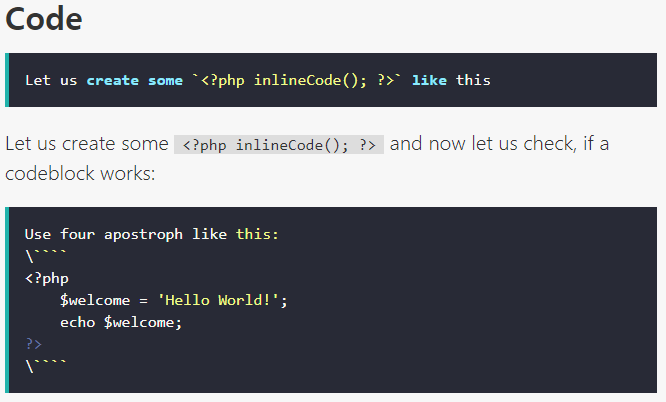
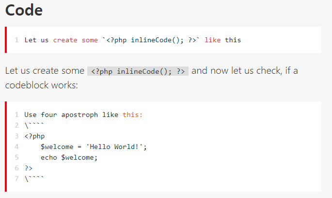
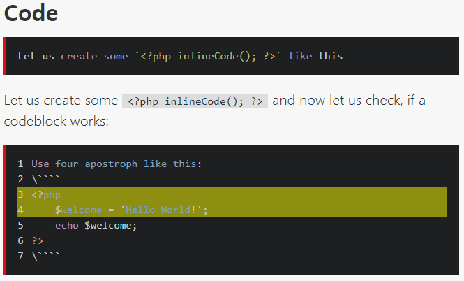
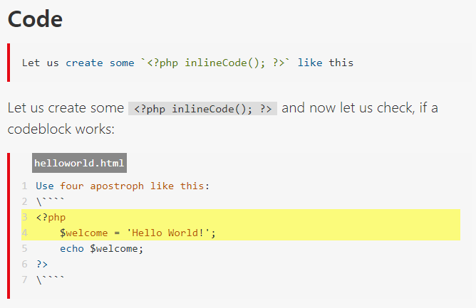

# highlight
Highlight your code examples with highlight.js for [typemill](https://typemill.net/)


## Adding feature
- Selecting [highlight.js]() theme
- Show line number using [highlightjs-line-numbers.js](`https://wcoder.github.io/highlightjs-line-numbers.js/`)
- Emphasize lines using [highlights-highlight-lines.js]()
- Show file name using [highlightjs-highlight-filename.js](`https://github.com/TRSasasusu/highlightjs-highlight-filename.js`)

## Pretreatment
- Remove the code below in `/theme/cyanine/css/style.css`
```css
/* Fix background for hightlight plugin */
code.hljs{ background: transparent; }
```
- Add the code below for handle JSON options in `function blockFencedCode()` 
  - `typemill\system\vendor\erusev\parsedown\Parsedown.php (line: 488)`
```php
if ($infostring !== '')
{
    /**
     * https://www.w3.org/TR/2011/WD-html5-20110525/elements.html#classes
     * Every HTML element may have a class attribute specified.
     * The attribute, if specified, must have a value that is a set
     * of space-separated tokens representing the various classes
     * that the element belongs to.
     * [...]
     * The space characters, for the purposes of this specification,
     * are U+0020 SPACE, U+0009 CHARACTER TABULATION (tab),
     * U+000A LINE FEED (LF), U+000C FORM FEED (FF), and
     * U+000D CARRIAGE RETURN (CR).
     */
    $language = substr($infostring, 0, strcspn($infostring, " \t\n\f\r"));

    $Element['attributes'] = array('class' => "language-$language");

    // Add highlight options in '<code>' element
    $matches = array();
    if (preg_match('/({.+}$)/', $infostring, $matches))
    {
        $Element['attributes']['data-options'] = $matches[1];
    }
}
```


## Snapshot image

### 1. Changing theme(dracula)


### 2. Changing theme(github) + Line number


### 3. Changing theme(tomorrow-night) + Line number + Line highlight


### 4. Changing theme(stackoverflow-light) + Line number + Line highlight + filename



## Code Block Options

First let's look at an example.

```markdown
​````php {highlightLines: [3, 4], filename: "helloworld.html"}
Use four apostroph like this:  
\````
<?php
	$welcome = 'Hello World!';
	echo $welcome;
?>  
\````
```
After the block code declaration, the first line is defined in JSON format.

### Options are:

| name                    | type      | default value          | Description                                  |
| ----------------------- | --------- | ---------------------- | -------------------------------------------- |
| singleLine              | boolean   | false                  | enable plugin for code block with one line   |
| startFrom               | int       | 1                      | Start numbering from a custom value          |
| highlightLines          | int array | []                     | Arrangement of lines for emphasis            |
| highlightColor          | string    | rgba(255, 255, 0, 0.5) | The color of the line to emphasize           |
| filename                | string    | null                   | File name or description including file name |
| filenameBackgroundColor | string    | #888                   | Background color of the file name            |
| filenameColor           | string    | white                  | Text color of the file name                  |
| filenameAlgin           | string    | left                   | Align of file name position (left or right)  |

